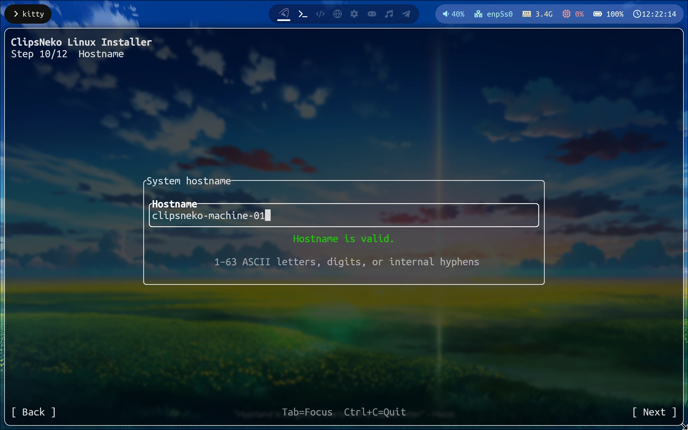

# Hostname settings
A hostname is a unique name created to identify a computer on a network. You can set it at this step ->

You can use letters, hyphens, and digits.

According to [RFC 1178](https://datatracker.ietf.org/doc/html/rfc1178), uppercase letters should not be used. Our installer allows this exception, however, so using uppercase letters is fine.