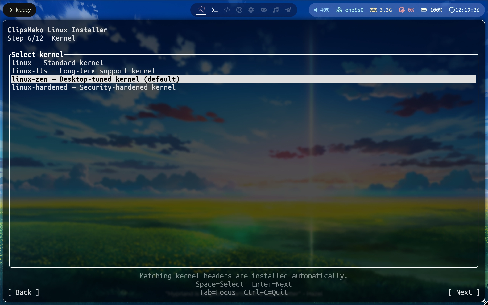

# Select a kernel
ClipsNeko Linux provides several Linux kernels for different purposes ->

These kernels differ in features and performance. Choose the one that best suits you:
- **linux**: the general-purpose kernel. The default kernel of upstream Arch Linux.
- **linux-lts**: the long-term support kernel. It is usually older, with the best stability and compatibility, but is not suitable for new hardware.
- **linux-zen**: a kernel optimized for desktop interaction and the default option in ClipsNeko Linux.
- **linux-hardened**: a kernel with hardened security settings that may be incompatible with some programs.