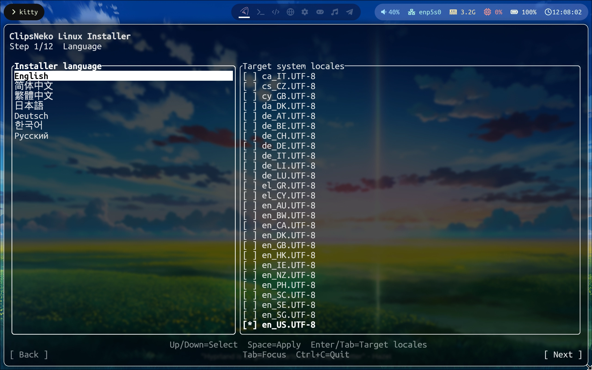
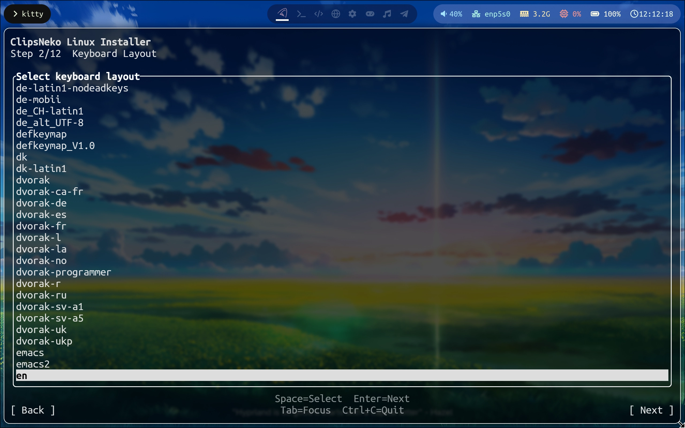

# Language and locale settings
After starting the installer, you will see ->

The left side is the installer's language-selection menu, which allows one selection; the right side is the locale-selection menu, which allows multiple selections.

Use **Tab** to switch between tables and buttons, the **arrow keys** to move between options, and **Space** to select an option.

The language selected on the left will also be selected on the right (and can be deselected). After finishing the settings, use **Tab** to move the cursor to Next, or press **Enter** directly, to continue.

## Select the locales to enable
In any GNU/Linux distribution, the corresponding locale must be generated to display a language. Fortunately, ClipsNeko Linux automates this process. Select the languages you want to enable and the installer will handle the rest.

Usually, you only need to switch the installer language to the language you plan to use on the final system, and the corresponding locale will be enabled automatically. When installing ClipsNeko Linux for a user of another language, you can deselect your own locale, select the target user's language, and use your language only in the installer.

Browse up and down and press **Space** to enable a locale.

::: warning Note
At least one locale must be selected.
:::

## Define the LANG variable
The LANG variable determines the default language used in the terminal. Most programs with localization support follow this variable.

In ClipsNeko Linux, we set the global LANG variable by defining `/etc/locale.conf`. The installer handles this process as well.

Press **L** to choose one locale as the LANG variable. If the locale selected with **L** is not enabled, it will be enabled automatically.

In the locale-selection menu on the right, one option is marked with `*` and the others with `x`. The locale used as the **LANG variable** is marked with `*`; the **other enabled** locales are marked with `x`.
::: warning Note
Only one locale can be set as the LANG variable, and it must be one of the enabled locales.
:::

## Select the keyboard
There are many kinds of keyboards in the world, and the same input signal can represent different keys. We therefore also provide a keyboard-layout selector ->

If you use a keyboard other than en, you probably know what this is and which keyboard you use. Select it from the list.

If you do not know what this is, congratulations: your keyboard is an en keyboard, so you can press **Enter** to skip this step.