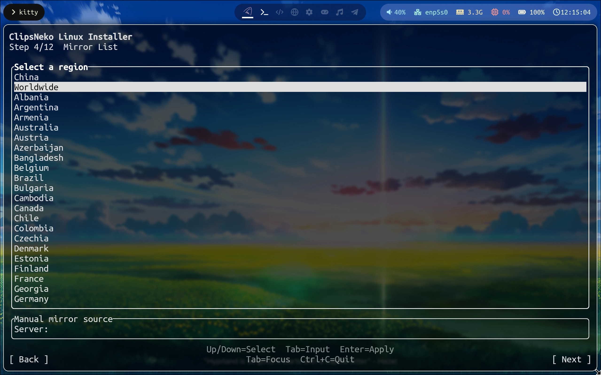

# Mirror selection
::: tip Tip
Most GNU/Linux distributions provide online software repositories. With a package manager, you can install and configure software without compiling from source or downloading build artifacts manually.
:::
We provide a choice of mirror groups and custom mirrors ->

Choose a nearby mirror group based on your region. For example, users in Australia can select Australia.

::: tip Tip
Each mirror group contains several mirrors located in the selected region. Accessing a mirror from that region provides low latency and potentially higher bandwidth.
:::

## Manually set a mirror (advanced)
You can enter a mirror URL manually at the bottom. It must be a complete URL (the level containing the repository database files). The installer verifies manually entered sources, and the interface may appear frozen for a while during this operation.
