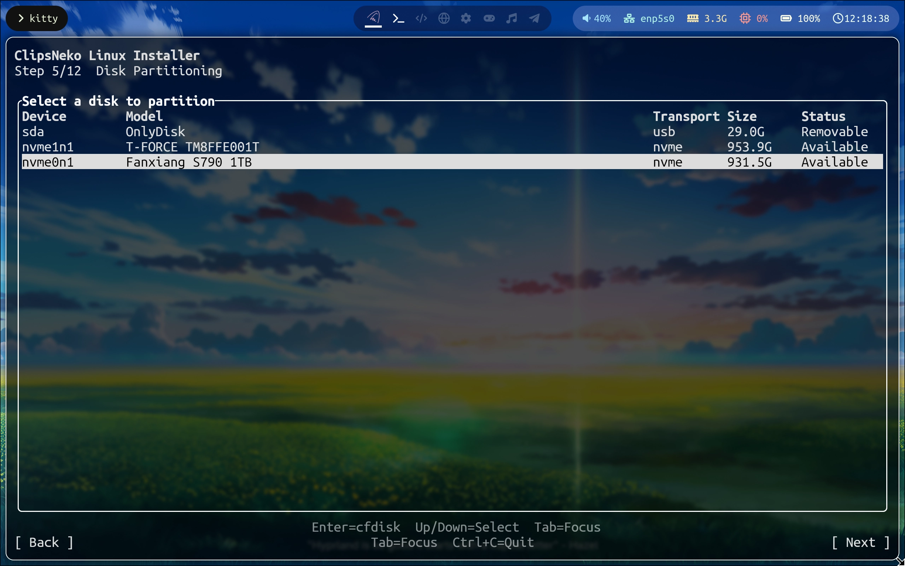
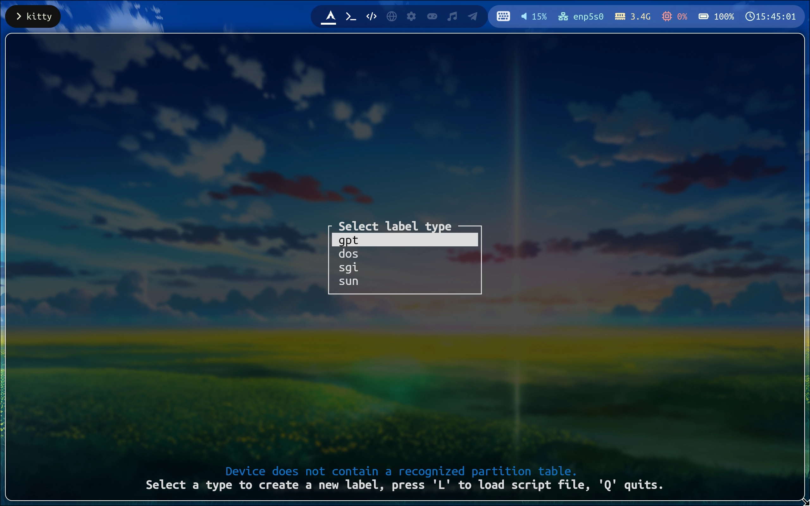
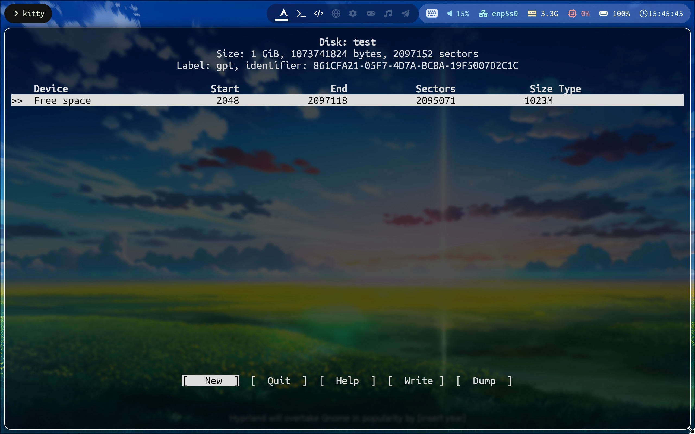
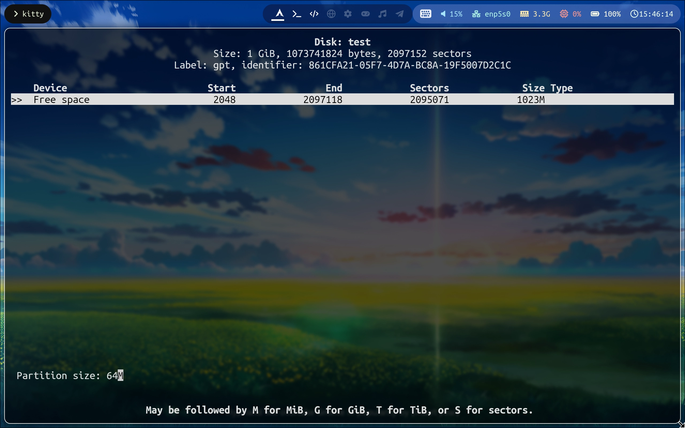
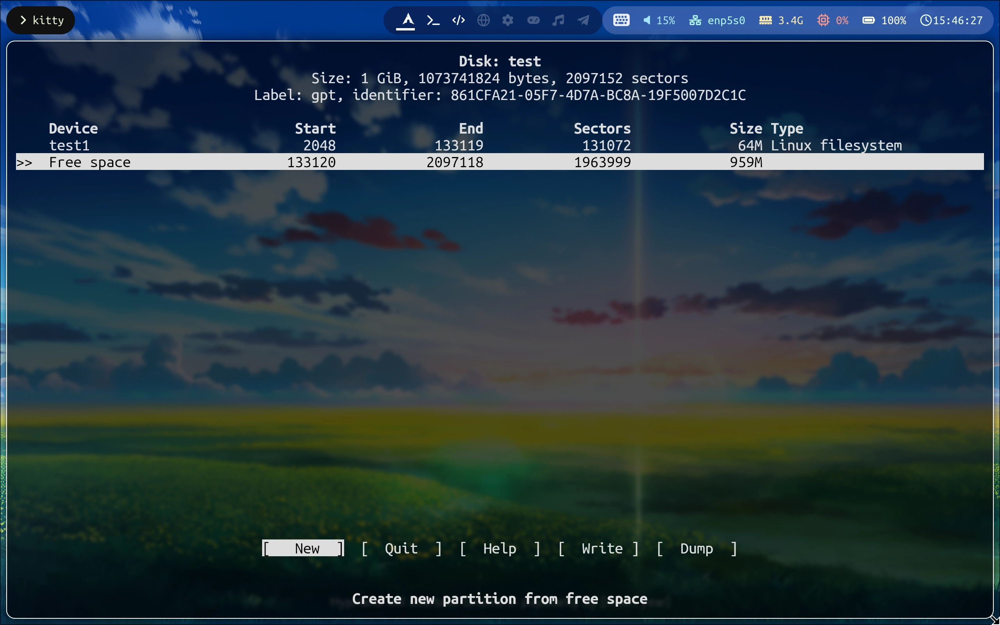
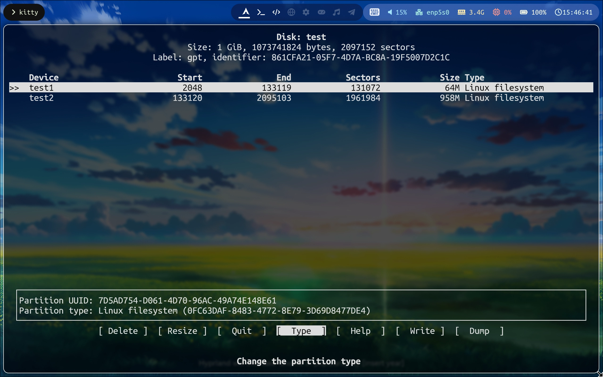
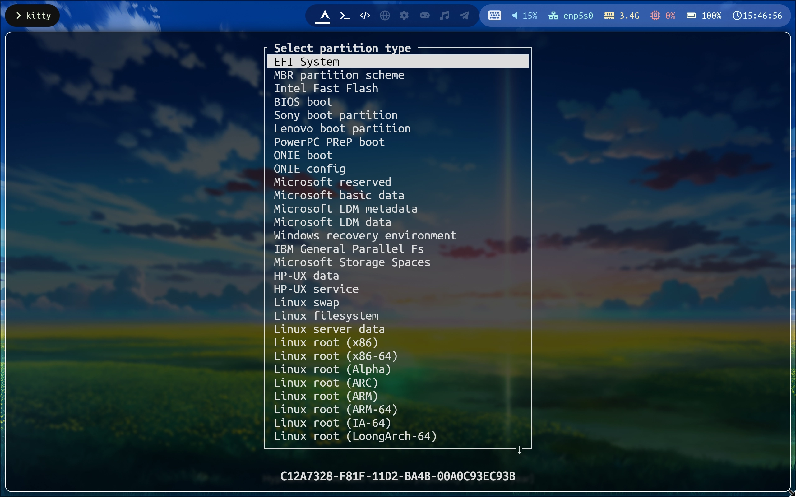
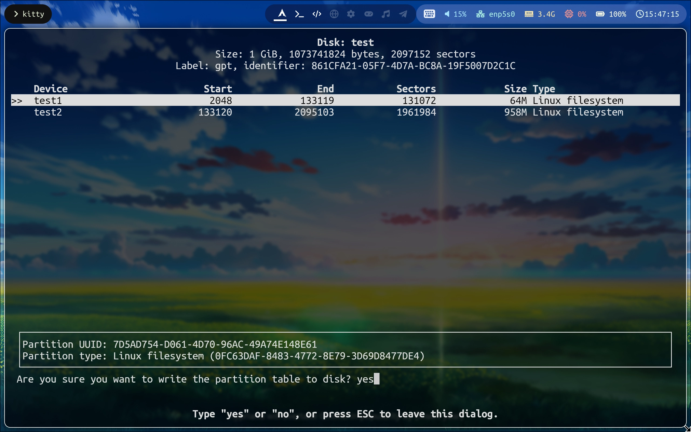
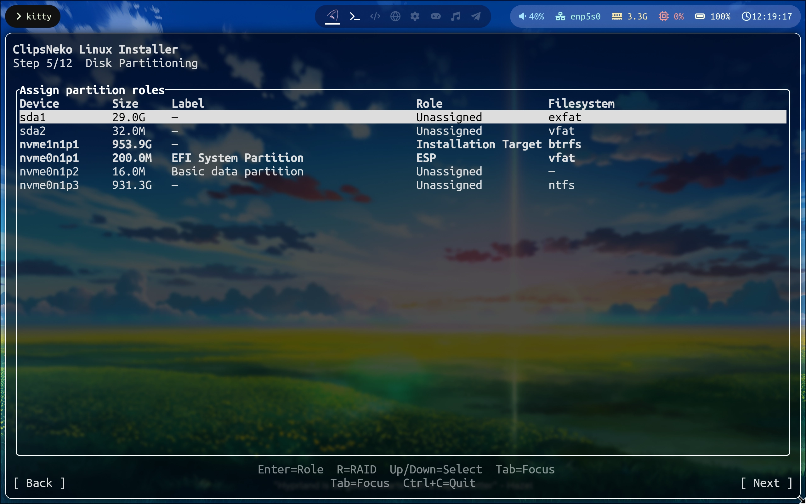

# 磁盘分区
您需要一个或多个**空闲的分区**来安装操作系统。ClipsNeko Linux 支持基于 Btrfs 设备池的软 RAID0 以及 RAID1。
::: tip 提示
为保证体验，您需要至少 **20 GiB 的空闲空间**来安装 ClipsNeko Linux.
:::
::: danger 警告
使用 `cfdisk` 会修改分区表。请提前检查是否有重要数据，并仔细核对选择的设备与进行的操作。由此造成的分区数据丢失，ReSpring ClipsNeko Co., Ltd. 无法对此负责。
:::
选择磁盘以使用 `cfdisk` 进行分区 ->

您可以看到最左侧显示的设备路径。通常，如果您使用 SATA 硬盘，那么硬盘的设备路径会显示为形如 **sda** 或 **sdb** 以及 **sdc** 等等类似 **sd?** 的形式, 而 USB 驱动器也会显示为此类型。在此情况下，您需要核对后面的型号和容量。

如果您使用的是 NVME 硬盘，这种情况下设备路径会显示为 **nvme0n1** 等形式，这时它们是您的机器内置硬盘，可以选择它们并按 **Enter** 以使用 `cfdisk`.

对选择的设备按 **Enter** 即可打开 `cfdisk`.

如果您的磁盘没有分区表（新磁盘）->

您会看到设备需要新建一个分区表。这时，选择 **gpt**.
::: tip 提示
因为 ClipsNeko Linux 使用 UEFI, 需要使用 GPT 分区表。
:::

在成功创建分区表之后，您可以看到 ->

按下左右方向键，可以在选项之间移动。按下上下方向键，可以在分区之间移动（这时，我们还没有分区）。

选择 **New** 以创建一个新的分区 ->

您可以填写分区大小。这包括单位，**M** 表示 **MiB**，而 **G** 表示 **GiB**.

对于 ClipsNeko Linux, 我们需要 ->
- **ESP (EFI system partition)**，至少需要 **64 MiB** 的空间。
- **用于安装操作系统的空间（由一个或多个分区组成）**，至少需要共 **20 GiB** 的可用空间（大于 20 GiB）。

刚才建立了 ESP 分区，再建立一个用于安装操作系统分区 ->

然后调整 ESP 分区的类型 ->

在这里，选择 **EFI System** 以将 ESP 分区设置成正确的类型。

回到主界面后，选择 **Write** 以将改动写入硬盘 ->
::: danger 警告
这一步将会修改分区表。请提前检查好修改是否符合预期。
:::
您需要输入 **yes** 以确认分区表的修改。

最后，选择 **Quit** 以退出 `cfdisk`.

## 跨多分区安装
您需要确保最终选择的分区，经过您选择的 RAID 选项计算之后，可用空间大于 20 GiB（不包括 20 GiB）。

### Btrfs RAID 可用空间计算方式
Btrfs 支持两种 RAID 类型：
- RAID 0: 仅作分区融合，容量为分区容量之和（因元数据为 RAID 1, ClipsNeko Linux 计算可用容量的方式仅为最小的分区容量的两倍）
- RAID 1: 镜像两个磁盘，总容量为最小分区的容量。

因此 ->
| 示例        |   类型  |  大小  | 可安装 |
| :---------: | :----: | :----: | :---: |
| 10 + 10 GiB | RAID 0 | 20 GiB | 否    |
| 10 + 12 GiB | RAID 0 | 20 GiB | 否    |
| 11 + 12 GiB | RAID 0 | 22 GiB | 是    |
| 10 + 10 GiB | RAID 1 | 10 GiB | 否    |
| 10 + 12 GiB | RAID 1 | 10 GiB | 否    |
| 20 + 20 GiB | RAID 1 | 20 GiB | 是    |
相信通过这个表格您可以了解 ClipsNeko Linux 的可用空间计算。

选择下一步，以进入到分区角色分配 ->

在这里，您可以看到存在的可用分区。

从左到右，分别是：

**设备路径** **分区大小** **分区类型** **角色** **文件系统**

您在这一步需要设置的是**分区的角色**。

在我们的安装程序中，有以下角色：
- **ESP**：EFI 系统分区，有且只有一个，具有 GPT EFI 系统分区类型，使用 vfat 文件系统。
- **安装目标**：系统将格式化为 Btrfs，并将在其中自动创建 `@` 和 `@home` 子卷。可以选择一个或多个。
- **未分配**：该分区不会被安装程序使用。

您需要做的，就是将前文中创建的几个分区分配好它们的角色。

按 **Enter** 弹出角色选择菜单，并选择角色以分配。

::: warning 提示
只能存在**一个 ESP 分区**，可以选择**多个安装目标分区**。
:::

如果您正确的分配了分区角色，就可以进入到下一步了。