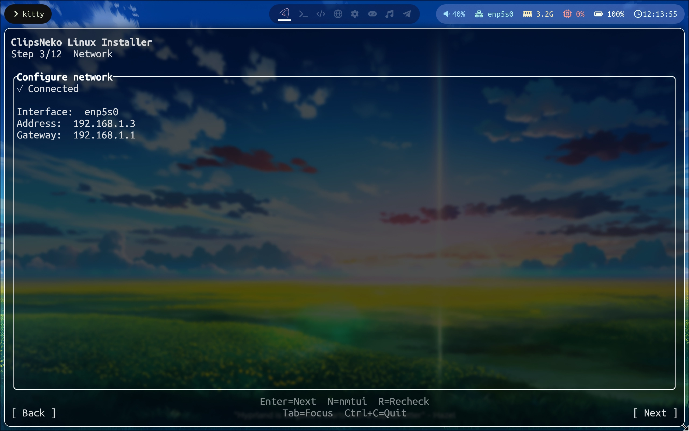
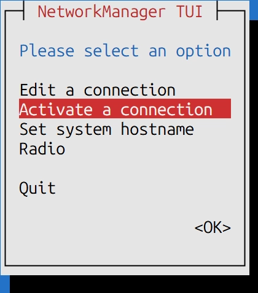

# 网络设置
我们是滚动发行版，采用网络安装，这样可以使您直接获取到最新的软件包与安全更新。

因此，安装过程需要网络连接。

如果您的电脑这时候插着网线，那么您可能看到类似如下的页面 ->


这表示您已经连接到网络，可以直接进行下一步了。

如果显示 **Disconnected**, 这说明您需要进行网络配置。因为有线网络一般畅通，本篇只专注于无线网络的描述。如有疑难杂症，请联系网络业务提供商获取帮助。

## 使用 Network Manager TUI
在显示 **Disconnected** 的页面，按下 **Enter** 键，会自动打开 Network Manager TUI, 也就是运行了命令 `nmtui`.

选择 **Activate a connection**, 之后在 **Wi-Fi** 一栏，就可以看到环境中存在的无线网络的 SSID 了。选择您的网络，然后按 **Enter**，再输入密码……大功告成。

按 **Tab** 切换光标至 **Back**, 然后 **Quit** 以退出 `nmtui`, 之后网络状态会自动刷新。一旦您成功连接网络，就可以进行下一步了。

如果您没有看到任何 SSID, 而您确认附近存在无线网络，这可能是RFKill子系统在软件层面禁用了无线网卡。此时您可以尝试使用 **SUPER + 2** 切换至工作区 2，按 **SUPER + T** 再打开一个 kitty, 使用命令 ->
```zsh
sudo rfkill unblock all
```
以解除对无线网卡的限制。

按 **SUPER + 1** 切换回工作区 1，退出 `nmtui`, 再重试一次，如果依然不行，很大概率上是您的硬件过新，而 Linux 内核主线驱动树还未支持。这时，您可以寻找社区驱动，或者更换无线网卡。不过，这些都是有一定技术需求的操作。而本文受限于篇幅与硬件的多变性，无法详细讲解。