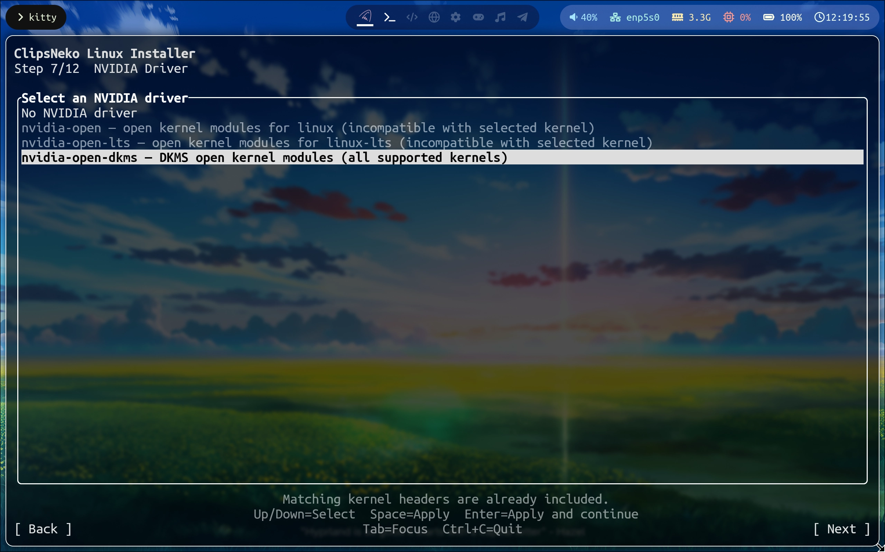

# 選擇顯示卡驅動
GNU/Linux 發行版的一大話題就是和 NVIDIA 不相容，顯示卡驅動安裝難度高。而 ClipsNeko Linux 通過在 Live CD 中整合 NVIDIA 驅動與安裝程式中的自動化安裝，使您不需要忍受手動安裝的痛苦 ->

如果您使用的是 **Intel 或 AMD 的顯示卡**，則**不需要 NVIDIA 驅動**。在這種情況下，安裝 NVIDIA 驅動後模組不會載入，除了佔空間之外沒有其他壞處，不過仍建議您選擇不進行 NVIDIA 驅動的安裝。

## 驅動與核心的相容性
因為安裝方式的差異，使得部分核心只能使用 dkms 安裝。相容性如下表所示：
| 核心 | 可選驅動 |
| --- | --- |
| linux | nvidia-open、nvidia-open-dkms |
| linux-lts | nvidia-open-lts、nvidia-open-dkms |
| linux-zen | nvidia-open-dkms |
| linux-hardened | nvidia-open-dkms |

您可以放心安裝 nvidia-open-dkms, 它相容所有核心。
