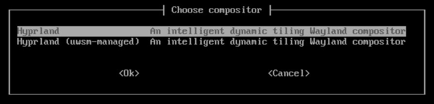

# 安裝 ClipsNeko Linux

本文介紹如何使用 ClipsNeko Linux Live CD 和 TUI 安裝程式完成 ClipsNeko Linux 的安裝。

::: danger 警告

安裝過程中選中的目標分割槽會被格式化，造成已有資料丟失。請提前檢查是否有重要資料，並在最終確認頁面逐項核對磁碟、ESP 分割槽和安裝目標。由此造成的資料丟失，ReSpring ClipsNeko Co., Ltd. 無法對此負責。

:::

## 安裝前準備

### 確認硬體條件

- **一臺 x86_64 架構（建議為2008年以後的CPU）、支援 UEFI 啟動的 PC。**
- **至少 2GiB 的記憶體**（Live CD 上的 Hyprland 需要 2GiB 的記憶體）。
- 一個擁有**大於 20 GiB 可用空間（不包括 20 GiB）的安裝目標分割槽**（或使用 Btrfs RAID0，可用空間計算如下述）。
- **一個可用的網路連線。**
- 一個用於製作啟動盤的 U 盤（可用空間需大於 2GiB）。

安裝程式只支援 UEFI + GPT，不支援傳統 BIOS + MBR 安裝方式。
您可以關閉會阻止啟動第三方系統的安全啟動，或者為 Live 映象配置相應的簽名信任。

#### Btrfs RAID 可用空間計算方式
RAID 0 : 選定的最小分割槽大小 * 2

RAID 1 : 選定的最小分割槽大小
| 示例       |   型別  |  大小  |
| :--------: | :----: | :----: |
| 8 + 10 GiB | RAID 0 | 16 GiB |
| 8 + 10 GiB | RAID 1 | 8 GiB  |
| 8 + 12 GiB | RAID 1 | 8 GiB  |

### 製作安裝介質並啟動 Live CD

1. 下載 ClipsNeko Linux Live CD iso ->
https://repo.clipsneko.cc/iso/latest/clipsneko-x86_64.iso
2. 使用工具將其寫入到USB驅動器或者燒錄光碟（不建議）

    推薦使用寫入工具 [balenaEtcher](https://mirrors.bfsu.edu.cn/github-release/balena-io/etcher/LatestRelease/)
    或 [Ventoy](https://www.ventoy.net/en/download.html)
3. 重啟後按主機板廠商的指引設定USB啟動或選擇USB啟動（若失敗請先[關閉安全啟動](https://www.google.com/search?q=how+to+disable+secure+boot)）
4. 等待進入 tty 環境之後，會自動登入 installer 使用者，稍作片刻等待，就會啟動 uwsm ->

5. 按 Enter 進入 Hyprland 桌面。

::: tip 提示
如果在引導時迴圈重啟，並且Systemd log輸出往往是到和網路相關的部分卡住

關機，然後拔掉電源線，等待十秒以上再插電開機
:::
