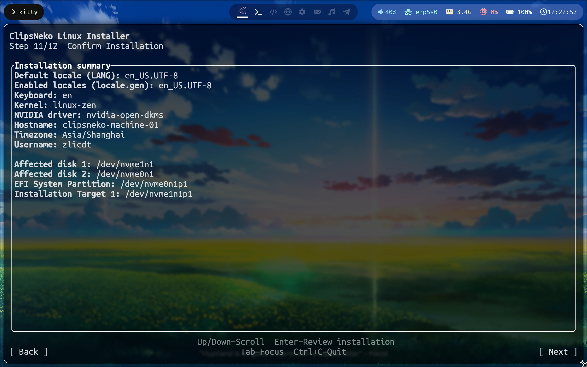

# 安裝確認
在這一步，將會列出前文所有您選擇的選項 ->

在這一步，您可以檢查安裝的內容是否合意，**如果不行，就可以退回去修改**。

在按下 **下一步** 並確定安裝前，都是可以恢復的。
::: danger 警告
一定要仔細檢查磁碟分割槽是否正確，這一步會摧毀選定目標分割槽上的所有內容。由此造成的資料丟失，ReSpring ClipsNeko Co., Ltd. 無法對此負責。
:::
一旦您確認安裝，就會進入到安裝步驟，此時磁碟會被格式化。
