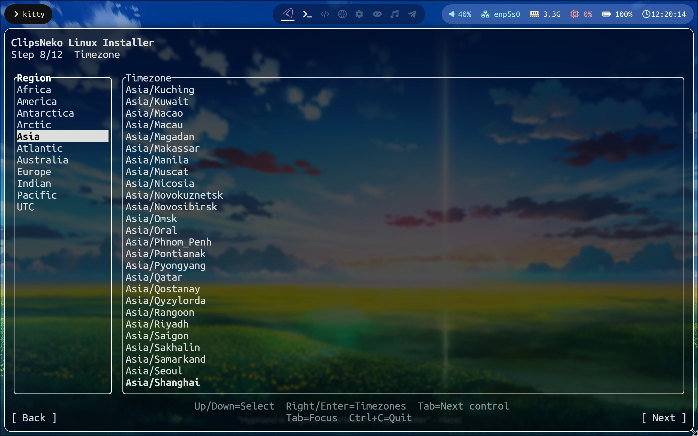

# 時區設定
您可以設定系統所處的時區。BIOS 時鐘將被設定為 UTC 時間並使用 NTP 同步時間，選擇時區以使用本地時 ->


## Windows 時間問題
如果使用雙系統，您也許現在還未注意到，不過當系統安裝完畢後，您重啟選擇 Windows 後，就會看到 Windows 的時間被設為了 UTC 時間。

這是因為 Windows 預設將本地時作為時間標準，並且會向 BIOS 時鐘同步本地時。在預設情況下，BIOS 時鐘的時間會是本地時，所以在每次開機、未同步時，Windows 就會讀取 BIOS 時鐘，並且將時間直接作為本地時顯示，而此時 BIOS 時鐘已被更改為 UTC 時間，所以 Windows 就會直接顯示 UTC 時間。

如果這時您選擇在 Windows 中同步時間，BIOS 時鐘仍會被修改為本地時，回到 ClipsNeko Linux 之後，您會發現此時的時間為 UTC + 兩倍的本地時偏移。

因此，最好的方法是**讓 Windows 也使用 UTC 作為操作 BIOS 時鐘的基準**。

**SUPER + R** 執行 **cmd**, 然後輸入：
```
reg add "HKEY_LOCAL_MACHINE\System\CurrentControlSet\Control\TimeZoneInformation" /v RealTimeIsUniversal /d 1 /t REG_DWORD /f
```